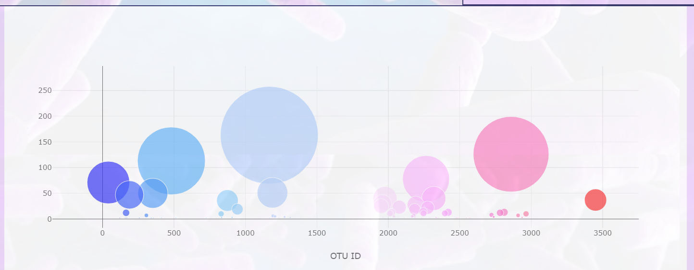

# Plotly Challenge

### This project is to showcase data visualization using interactive charts constructed with Plotly. The completed project can be viewed on [GitHub Pages](https://psychicesp.github.io/Plotly-challenge/)  
  
 

These data represent microbial biodiversity found in study participants' belly buttons.

The page will show the results of a single test subject selected "Test Subject ID#" dropdown menu:
 

Once selected you will see the following:
 

An overview of their Demographics:
 

A horizontal bar chart showing the top ten most prevalent microbes by 'OTU ID':
 

A gauge visualization showing how frequently the subject admits to scrubbing their belly button relative to the max value of the study:
 

And a bubble chart showing relative abundances between different OTU IDs:
 

 
The data for visualizing comes from [http://robdunnlab.com/projects/belly-button-biodiversity/](http://robdunnlab.com/projects/belly-button-biodiversity/) and is in static/js/samples.json

